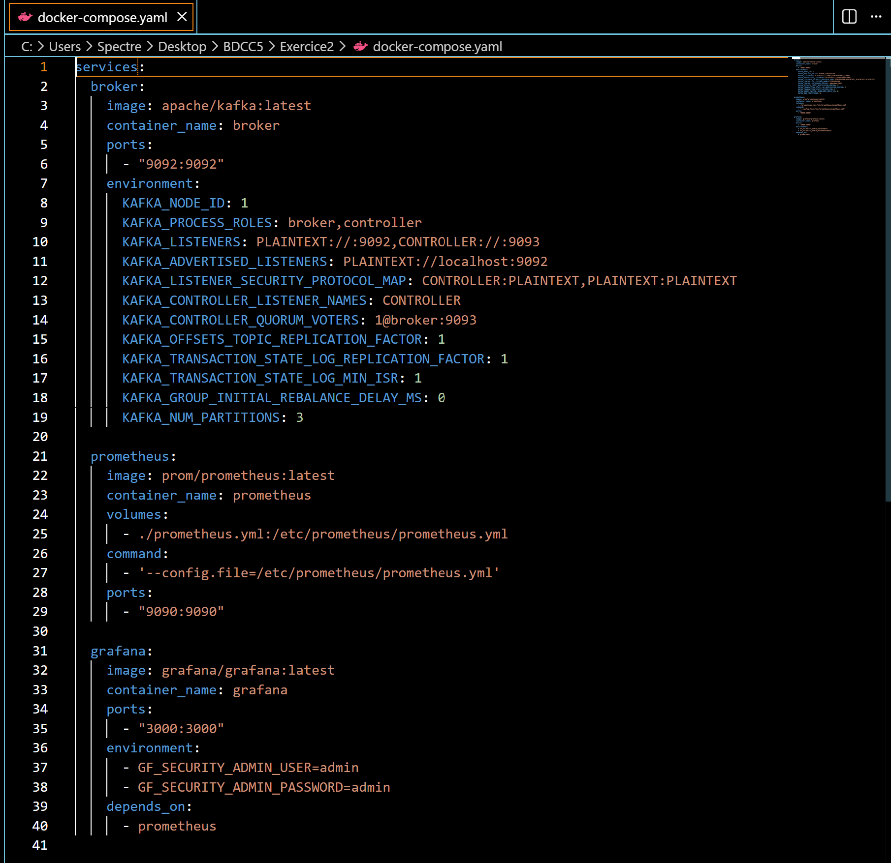
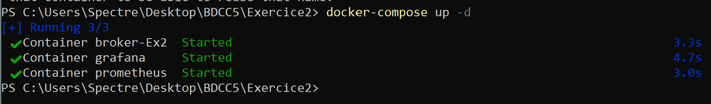
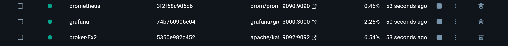
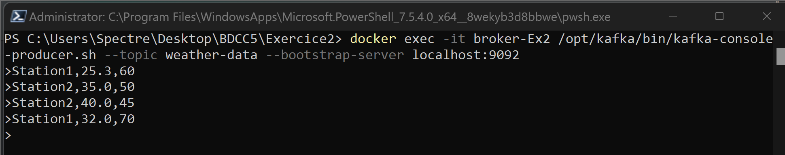
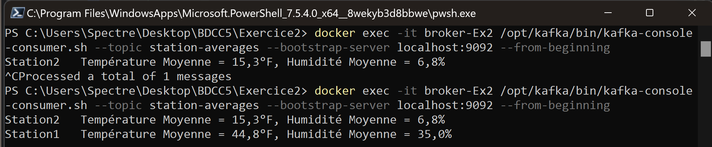
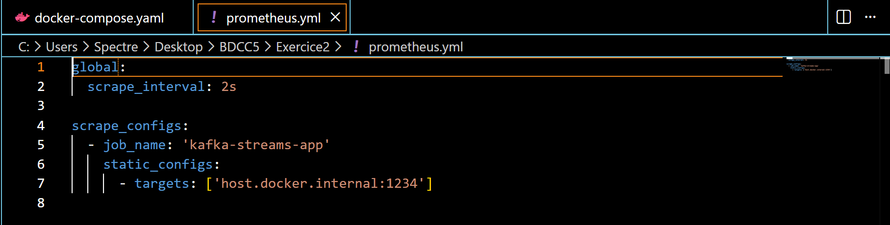
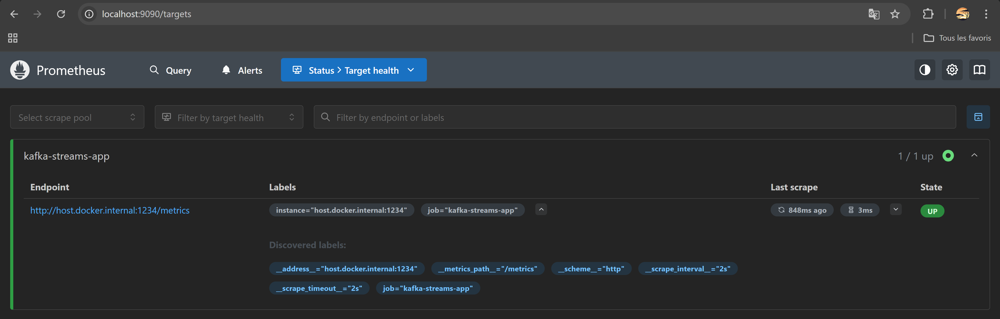
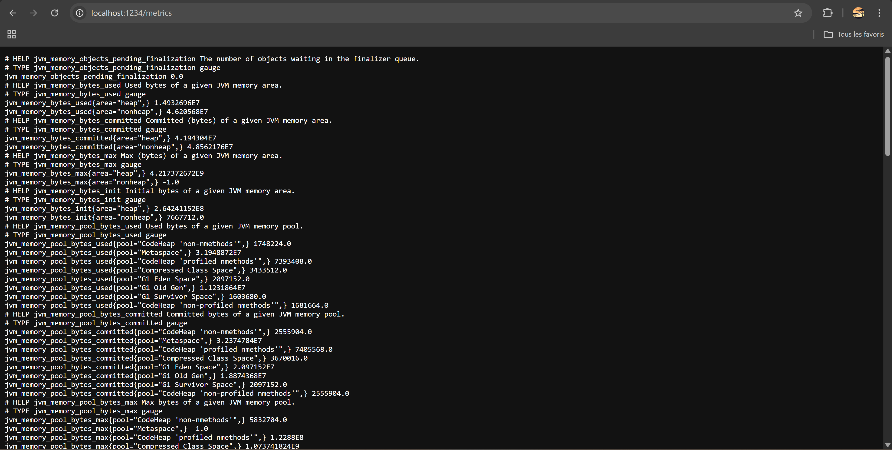
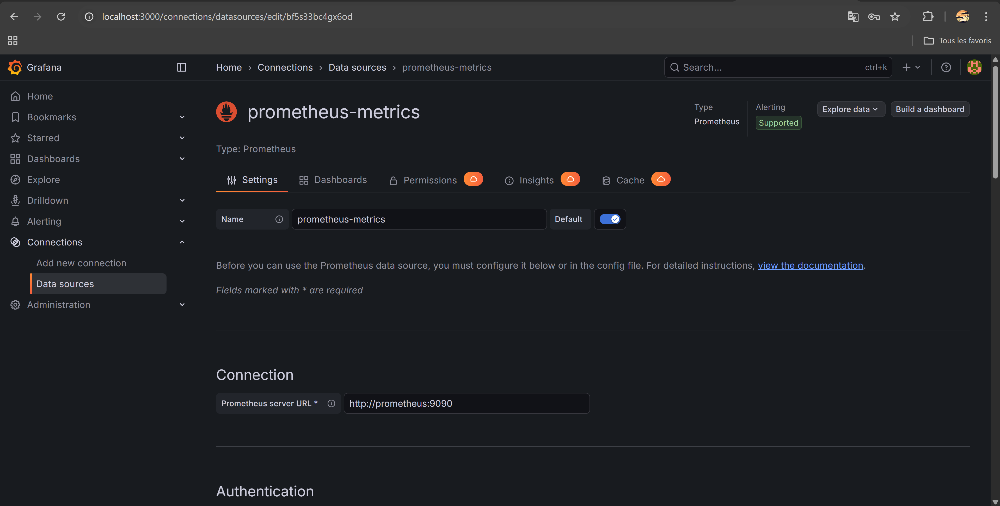
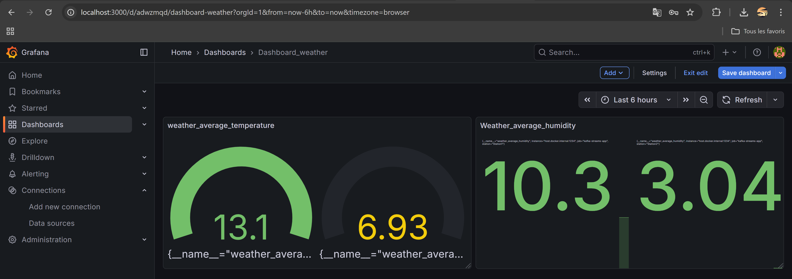

## Weather Monitoring with Kafka Streams, Prometheus & Grafana

This project is a **real-time weather monitoring system** using **Kafka Streams**, with metrics collected via **Prometheus** and visualized in **Grafana**.

### 🔹 Features

- Reads weather data from a Kafka topic `weather-data`.
- Filters temperature readings above **30°C**.
- Converts temperatures from **Celsius to Fahrenheit**.
- Aggregates average **temperature** and **humidity** per station.
- Publishes aggregated results to the Kafka topic `station-averages`.
- Exposes **custom Prometheus metrics** for:
  - Average temperature per station.
  - Average humidity per station.
- Visualize metrics in **Grafana dashboards** with gauges and time-series charts.


### 🔹 Project Structure
```
WeatherStreamApp/
├── src/
│ └── main/java/org/app/WeatherStreamApp.java
├── docker-compose.yml
├── prometheus.yml
├── pom.xml
└── README.md
```

### 🔹 Prerequisites

- Java 21+ / OpenJDK
- Maven
- Docker & Docker Compose
- Kafka & Zookeeper (run via Docker Compose)
- Grafana (via Docker Compose)
- Prometheus (via Docker Compose)

### 🔹 How to Run

1-Build Java application

2-Start Docker services
```
docker-compose up -d
```






3-Run Java Kafka Streams App,This will:
- Start Kafka Streams
- Aggregate weather data
- Expose metrics on http://localhost:9100/metrics

4-Send test weather data

```
docker exec -it broker-Ex2 /opt/kafka/bin/kafka-console-producer.sh --topic weather-data --bootstrap-server localhost:9092
```

Then type some example messages:



5-Check results in Kafka topic

```
docker exec -it broker-Ex2 /opt/kafka/bin/kafka-console-consumer.sh --topic station-averages --bootstrap-server localhost:9092 --from-beginning
```



🔹 Prometheus



Metrics available at: http://localhost:1234/metrics


Prometheus server at: http://localhost:9090, configured to scrape Java app metrics via prometheus.yml

🔹 Grafana
- Grafana web UI: http://localhost:3000
- Login: admin / admin
- Add Prometheus as data source:
  


- URL: http://prometheus:9090 (if using Docker Compose)
- Create dashboards or import JSON dashboards for:

Temperature per station + Humidity per station


